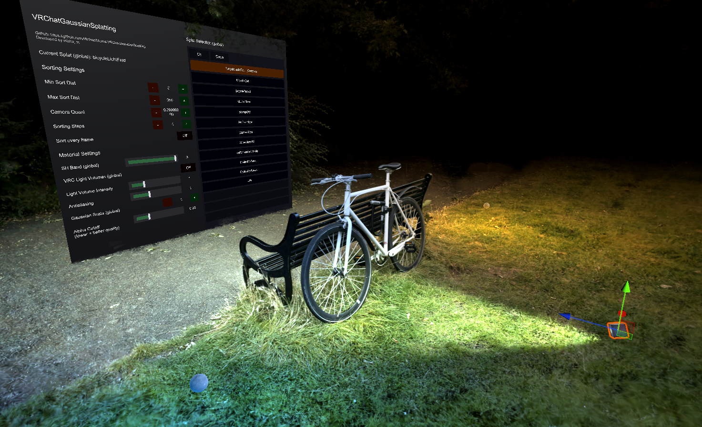

# VRChat Gaussian Splatting v4

Gaussian splatting for VRChat worlds: runtime camera-sorted rendering through Udon, a splat importer, an in-world gallery and control UI, automatic editor Scene-view sorting, and editor tools for terrain colliders and re-importing.

## Features

- Sorted-only runtime rendering through `GaussianSplatRenderer`
- Importer for `.ply` and `.spz` splats from `Gaussian Splatting / Import Splats...`
- Import modes: **LOD** (combined, with a level-of-detail hierarchy) and **Standalone** (self-rendering, precomputed sorting)
- Combined runtime rendering — all active splats transformed into world space and sorted together
- **LOD hierarchy** — an import-time LOD pyramid; the runtime selects per-chunk detail against a scene-wide, per-platform splat budget, with in-world quality tiers and an LOD Splat Cap
- In-world **gallery** UI: list splats, show one at a time, optional master lock
- Automatic scene renderer + world-space control UI when splats are present
- Automatic, editor-only Scene-view sorting for every `GaussianSplatObject`
- Editor tools: **terrain collider** generation, and **re-import** (exact / edit-settings) from a splat's stored import metadata
- Android build conversion to no-geometry, fake-sRGB splat shaders
- Bilingual UI (English / 日本語)
- VRC Light Volumes integration

## Quick Start

1. Import the unitypackage from [releases](https://github.com/MichaelMoroz/VRChatGaussianSplatting/releases), or clone the repo.
2. Open `Gaussian Splatting / Import Splats...`.
3. Add one or more `.ply` / `.spz` files, choose an output folder, and pick an **Import Mode**.
4. Configure the import options (see below) and import.
5. Drag the imported prefabs into the scene. The editor automatically creates the scene `GaussianSplatRenderer` and the world-space control UI when needed.
6. Tune material/render settings from the renderer inspector or the in-world UI.

### Import Modes

- **LOD** (default) — a combined `GaussianSplatObject` with a downsampled LOD pyramid. The combiner selects per-chunk detail by camera distance and a scene-wide splat budget; full-detail LOD0 is preserved up close.
- **Standalone** — a self-rendering mesh + material with **precomputed direction-based sorting** baked in. Renders without `GaussianSplatRenderer` (e.g. avatars, or outside VRChat). Uses more texture memory and can introduce artifacts.

### Import Options

**All modes:**
- `Compute Bounding Box`
- `Import Spherical Harmonics` + `Max SH Band` — memory scales with the chosen band; disabled forces SH0.
- `SH Compression` — `None` (RGB565), `BC1` (4 bpp), or `BC7` (8 bpp).
- `Compress Color+Alpha to BC7`
- **Transform / cleanup**: `Crop To Bounds` (preview box handle), `Horizon Alignment` / `Wall Alignment` (pick points in the preview), `Normalize Size` (scale the floater-robust extent to a target size).

**Combined (LOD) mode:**
- `Chunk Size` — combined-render chunk size.
- `LOD Resampling Rate` / `LOD Reused Splats` — tune the LOD pyramid's stored-splat count.

**Standalone rendering only** (combined splats render through the combiner and ignore these):
- `sRGB Color Correction` — the exact color/compositing path (two grab passes, needs HDR camera targets). **Forced off on Android.** See [Color reproduction & sRGB](#color-reproduction--srgb).
- `Multi-Pass Rendering` + `Splat Count Per Pass` + `Max Alpha Mask Count` — split rendering into sequential chunks; alpha-mask passes can occlude later chunks behind opaque geometry (a tradeoff, since grab passes are expensive). Requires `sRGB Color Correction` on.
- `Start Render Queue` — combined splats instead take their render queue from the `GaussianSplatRenderer` component.

## Runtime Rendering

Use this path to camera-sort splats at runtime in VRChat worlds (Udon):

1. Add imported Gaussian Splat Objects to the scene.
2. Let the editor create the scene `GaussianSplatRenderer` and UI, or select the renderer if it exists.
3. The renderer combines all active splats into one sorted render; use the gallery to show one at a time.
4. Enter play mode or build. The renderer updates sorted render order for the active (screen + photo) cameras.

### How rendering works

The renderer transforms all active splats into world space, writes them into combined render textures, and sorts the result as one renderer — so any number of active splats render together. Combined LOD selection, the per-platform splat budget, and the quality tiers build on top of this.

### Android Builds

A pre-build scene pass converts runtime splat renderers from the geometry-shader path to no-geometry shaders and replaces point meshes with zero-sized quad meshes (quad vertex IDs drive splat lookup, so the mesh stays cheap if drawn with the wrong material). The same pass swaps the fullscreen color-space grab-pass shaders for the fake-sRGB no-geometry path, because VRChat Android lacks the reliable HDR/grab-pass path. It also sets the scene renderer to Low quality and disables camera HDR.

## In-World UI

The renderer creates a world-space control canvas automatically when splats are present and the scene has none. It's intended as a real in-world control surface.

**Networking:** only the **gallery selection** is synced (manual sync). All other controls are **local** per user.

### Gallery mode

- Add splat objects to the renderer UI's **gallery list**. When the list has one or more entries, gallery mode is active and only the selected splat renders; objects not in the list are never touched.
- An inspector-only **enable** toggle keeps the list but shows all listed splats when off.
- A **master lock** restricts changing the selection to the instance master.
- Entry names/descriptions come from each `GaussianSplatObject` (with fallbacks).

### Controls

- Gallery selection (synced)
- Quality presets: Very Low / Low / Medium / High (set alpha cull + alpha cutoff)
- SH Band
- VRC Light Volumes (toggle) + Light Volume Intensity
- Gaussian Scale
- Alpha Cutoff (lower = better quality, higher cost) + Alpha Cull
- Antialiasing
- Camera Quantization
- Language (English / 日本語)
- An **Advanced Settings** toggle reveals the finer sliders
- LOD Splat Cap (shown only when LOD splats are present)

Render queue and the sort/material settings live on the `GaussianSplatRenderer` component inspector. Use `Update Sorting Resource Textures` there to resize the sorting textures to fit the largest assigned splat instead of editing those assets by hand.

## Terrain Collider

`Gaussian Splatting / Generate Terrain Collider…` (or the `GaussianSplatObject` context menu) rasterizes a splat into a heightmap on the GPU and builds a Unity `TerrainData` + `TerrainCollider`. Options cover terrain resolution, GPU batch size, small-splat filtering, and empty-pixel fill. It is a 2.5D (top-down) collider — good for ground/terrain, not overhangs or interiors.

## Editor Scene-View Sorting

- Automatic for every `GaussianSplatObject`; editor-only, no Udon.
- Owns its own transient sorting resources — it does not reuse the runtime `GaussianSplatRenderer` / `RadixSort` textures.
- Skips standalone precomputed-sorting materials; applies only to the sorted runtime path.
- Targets Scene-view cameras; inspector previews are not part of this pass.

## Tips

> [!TIP]
> The renderer automatically disables MSAA for splats in-game. Gaussian splats have very high overdraw, which makes MSAA extremely expensive for little or no benefit.

> [!TIP]
> Lower `Alpha Cutoff` keeps more splats and improves quality at higher cost. Fit sorting textures to the largest splat with `Update Sorting Resource Textures`.

> [!TIP]
> `sRGB Color Correction` (standalone imports only; forced off on Android) is the exact color/compositing path but adds two grab passes. Turning it off falls back to back-to-front blending, disables multi-pass, and makes color non-exact (see [Color reproduction & sRGB](#color-reproduction--srgb)).

> [!TIP]
> `VRC Light Volumes` is a scene-integration control: off keeps the splat near its baked look; on lets it pick up scene lighting (tune with `Light Volume Intensity`).

## Current Limitations

- Standalone precomputed sorting is a separate import path, not the same as runtime sorting.
- Very large splats are limited by available RAM and the combined render's splat-count cap.
- The terrain collider is 2.5D (heightmap), so it cannot represent overhangs, walls, or interiors.

## Credits

- `.PLY` importer adapted from [aras-p's UnityGaussianSplatting](https://github.com/aras-p/UnityGaussianSplatting)
- `.SPZ` format from [Niantic's spz](https://github.com/nianticlabs/spz)
- This repository is a heavily modified version of [lambdalemon's gaussian splats](https://github.com/lambdalemon/vrcsplat)
- The radix sort uses [d4rkpl4y3r's mipmap prefix sum trick](https://github.com/d4rkc0d3r/CompactSparseTextureDemo)

## Worlds in VRChat that use this

- [新・深夜の京都散歩 / New Kyoto Midnight Walk](https://vrchat.com/home/launch?worldId=wrld_02b99a48-ff5c-41a7-a8f1-1a472d2259ea)
- [Huge City Splat (85M splats)](https://vrchat.com/home/launch?worldId=wrld_d22b6e6a-d5e3-41fa-b7cb-f76813127df7)
- [Uncharted 4 Madagascar](https://vrchat.com/home/launch?worldId=wrld_bbccb4e0-1d09-4458-b263-33f9693113ec)
- [2.37 Million Splat Raspberry](https://vrchat.com/home/launch?worldId=wrld_9a028567-f1eb-467d-a895-0837559391e8)
- [Tiny Gaussian Splat Gallery](https://vrchat.com/home/launch?worldId=wrld_c491f8c0-0631-4381-9447-f3d326be2191)

---

# Technical Notes

## Runtime Radix Sort

As this is VRChat, we only have access to the normal rasterization pipeline without writable textures, buffers, or atomics, so the sorting path has to stay inside ordinary rendering primitives.

The runtime sorter uses a radix sort built on mipmap-based prefix sums. For radix sorting you only need prefix sums over digit occurrences, and from that you can reconstruct the sorted sequence. In this implementation each step sorts 4 bits at a time over 16-value digits, over a fixed number of passes (currently 6) covering the high bits of the distance key, which keeps the cost practical while still giving good ordering accuracy.

This same general sorted-order approach is used both by the runtime renderer and by the automatic editor Scene view renderer, but the editor path owns its own materials and transient render textures instead of reusing the runtime scene resources.

The same core idea could be reused for other VRChat rendering or simulation problems where you need ordering but do not have access to compute-style GPU primitives.

## Ellipsoid Screen Projection

Splats are rendered as projected billboards, with the screen-space ellipse for each one computed exactly rather than approximated.

The current implementation projects the Gaussian ellipsoid's quadric directly into clip space, extracts the resulting screen-space conic, and solves it analytically for the ellipse center, orientation, and axes. It is float-only, with no emulated double precision, and includes guarded divisions, bounded intermediate values, near-plane rejection for splats the camera is inside, and validity checks that keep thin or near-degenerate splats stable.

Compared with normal 3DGS rendering, this avoids the center-Jacobian affine projection approximation entirely. Standard 3DGS uses the Jacobian of a local affine projection around the Gaussian center, which is fast but introduces projection error that shows up as blur, shape drift, and scene inconsistency, especially important for VR applications where the camera can be very near the splats and can have very large fields of view.

This recovers the exact projected ellipse, the same result as ellipsoid-projection approaches such as "Projecting Gaussian Ellipsoids While Avoiding Affine Projection Approximation" (arXiv:2411.07579v2), obtained analytically from the projected conic rather than fitted or approximated.

Because they are rendered as billboards, keeping the projected ellipse tight matters a lot for overdraw. The exact projection preserves a stable, well-fitted screen-space footprint for the Gaussian and stays numerically robust on thin ellipsoids.

## Color reproduction & sRGB

`sRGB Color Correction` applies to the standalone import path only, and Android builds force it off. For standalone splats, exact color reproduction requires the color-space transform grab-pass path.

If you turn `sRGB Color Correction` off, there are two important side effects:

1. Rendering order has to fall back to back-to-front blending because there is no grab pass caching the current view color, so the multi-pass optimization path is no longer applicable.
2. Colors are no longer reproduced exactly. The color conversion still happens per splat, but the blending itself is no longer mathematically valid for the original training color space.

One workaround is to train the splats on images that were already color-converted into inverse sRGB space. Then the splats can be rendered without the runtime color-space conversion path, but you also need to turn off fake sRGB on the material.

## VRC Light Volumes

The shader can integrate with VRC Light Volumes through the `VRC Light Volumes` toggle and the `Light Volume Intensity` control.

- When enabled, the splat shader samples VRC Light Volume spherical-harmonic lighting at the splat world position.
- The sampled lighting is applied to the non-emissive part of the splat color, while values above `1.0` are preserved as emissive.
- `Light Volume Intensity` scales the contribution of the sampled light volume lighting.
- This affects shading only. It does not change the sorting path or render-order generation.
- Some splats look better as mostly self-lit imagery, while others benefit from picking up scene lighting, so this is intentionally exposed as a runtime control.

## Future Roadmap

* Custom Gaussian Splat object, with manually provided splat data textures (could be render texture generated procedurally)
* Animated transitions and effects for splat objects
* Progressive LOD load and web request support
* 3D collider generation
* 4DGS support (requires a commonly supported 4DGS format to be established first, it doesnt exist yet. Just a sequence of 3DGS is not an optimal representation for 4DGS.).

---
---

# VRChat Gaussian Splatting v4（日本語）

VRChat ワールド向けのガウシアンスプラッティング：Udon によるランタイムのカメラソートレンダリング、スプラットインポーター、ワールド内ギャラリー＆コントロール UI、エディタ Scene ビューの自動ソート、地形コライダーや再インポートのためのエディタツール。

## 機能

- `GaussianSplatRenderer` によるソート専用のランタイムレンダリング
- `Gaussian Splatting / Import Splats...` からの `.ply` / `.spz` スプラットインポーター
- インポートモード：**LOD**（統合、LOD 階層あり）と **Standalone**（自己レンダリング、事前計算ソート）
- 統合ランタイムレンダリング — アクティブな全スプラットをワールド空間へ変換し、まとめてソート
- **LOD 階層** — インポート時に生成する LOD ピラミッド。ランタイムはシーン全体・プラットフォーム別のスプラット予算に対してチャンクごとの詳細度を選択し、ワールド内の品質プリセットと LOD Splat Cap で調整
- ワールド内 **ギャラリー** UI：スプラットを一覧化し、1 つずつ表示、任意のマスターロック
- スプラットが存在するとき、シーンレンダラーとワールド空間コントロール UI を自動生成
- すべての `GaussianSplatObject` に対するエディタ限定の Scene ビュー自動ソート
- エディタツール：**地形コライダー** 生成、保存済みインポートメタデータからの **再インポート**（そのまま／設定編集）
- Android ビルドではジオメトリなし・疑似 sRGB スプラットシェーダーへ変換
- バイリンガル UI（英語 / 日本語）
- VRC Light Volumes 連携

## クイックスタート

1. [releases](https://github.com/MichaelMoroz/VRChatGaussianSplatting/releases) から unitypackage をインポートするか、リポジトリをクローンする。
2. `Gaussian Splatting / Import Splats...` を開く。
3. 1 つ以上の `.ply` / `.spz` を追加し、出力フォルダと **インポートモード** を選択する。
4. インポートオプション（下記）を設定してインポートする。
5. 生成されたプレハブをシーンにドラッグする。必要に応じてエディタがシーンの `GaussianSplatRenderer` とワールド空間コントロール UI を自動生成する。
6. レンダラーのインスペクター、またはワールド内 UI からマテリアル／レンダリング設定を調整する。

### インポートモード

- **LOD**（デフォルト）— ダウンサンプリングした LOD ピラミッドを持つ統合 `GaussianSplatObject`。コンバイナーがカメラ距離とシーン全体のスプラット予算からチャンクごとの詳細度を選択し、近距離ではフル詳細の LOD0 を保持する。
- **Standalone** — **事前計算した方向ベースのソート** を焼き込んだ自己レンダリングのメッシュ＋マテリアル。`GaussianSplatRenderer` なしでレンダリングする（アバターや VRChat 外など）。テクスチャメモリを多く使い、アーティファクトが出る場合がある。

### インポートオプション

**全モード：**
- `Compute Bounding Box`
- `Import Spherical Harmonics` + `Max SH Band` — メモリは選択したバンドに比例。無効化で SH0 を強制。
- `SH Compression` — `None`（RGB565）、`BC1`（4 bpp）、`BC7`（8 bpp）。
- `Compress Color+Alpha to BC7`
- **変換／クリーンアップ**：`Crop To Bounds`（プレビューのボックスハンドル）、`Horizon Alignment` / `Wall Alignment`（プレビューで点を選択）、`Normalize Size`（外れ値に強い範囲を目標サイズへスケール）。

**統合（LOD）モード：**
- `Chunk Size` — 統合レンダリングのチャンクサイズ。
- `LOD Resampling Rate` / `LOD Reused Splats` — LOD ピラミッドの保存スプラット数を調整。

**Standalone レンダリングのみ**（統合スプラットはコンバイナー経由でレンダリングされ、これらを無視する）：
- `sRGB Color Correction` — 厳密な色／合成パス（2 つの grab パス、HDR カメラターゲットが必要）。**Android では強制オフ。** [色再現と sRGB](#色再現と-srgb) を参照。
- `Multi-Pass Rendering` + `Splat Count Per Pass` + `Max Alpha Mask Count` — レンダリングを順次チャンクに分割する。アルファマスクパスは不透明ジオメトリの背後で後続チャンクを遮蔽できる（grab パスは高コストなためトレードオフ）。`sRGB Color Correction` オンが必要。
- `Start Render Queue` — 統合スプラットは代わりに `GaussianSplatRenderer` コンポーネントからレンダーキューを取得する。

## ランタイムレンダリング

VRChat ワールド（Udon）でスプラットをランタイムにカメラソートするには、このパスを使う：

1. インポートした Gaussian Splat Object をシーンに追加する。
2. エディタにシーンの `GaussianSplatRenderer` と UI を生成させるか、既存のレンダラーを選択する。
3. レンダラーはアクティブな全スプラットを 1 つのソート済みレンダリングに統合する。ギャラリーで 1 つずつ表示する。
4. Play モードに入るかビルドする。レンダラーはアクティブな（画面＋写真）カメラ向けにソート順を更新する。

### レンダリングの仕組み

レンダラーはアクティブな全スプラットをワールド空間へ変換し、統合レンダーテクスチャに書き込み、1 つのレンダラーとしてソートする — これにより任意の数のアクティブスプラットをまとめて描画する。統合 LOD 選択、プラットフォーム別スプラット予算、品質プリセットはこの上に構築される。

### Android ビルド

ビルド前のシーンパスが、ランタイムのスプラットレンダラーをジオメトリシェーダーのパスからジオメトリなしシェーダーへ変換し、ポイントメッシュをサイズ 0 のクアッドメッシュへ置き換える（クアッドの頂点 ID がスプラット参照を駆動するため、誤ったマテリアルで描画してもメッシュは安価なまま）。同じパスがフルスクリーンの色空間 grab パスシェーダーを疑似 sRGB のジオメトリなしパスへ差し替える（VRChat Android には信頼できる HDR／grab パスがないため）。さらにシーンレンダラーを Low 品質に設定し、カメラ HDR を無効化する。

## ワールド内 UI

スプラットが存在し、かつシーンに UI がないとき、レンダラーはワールド空間コントロールキャンバスを自動生成する。実際のワールド内コントロール面として意図されている。

**ネットワーキング：** 同期されるのは **ギャラリー選択** のみ（手動同期）。その他のコントロールはすべてユーザーごとの **ローカル**。

### ギャラリーモード

- レンダラー UI の **ギャラリーリスト** にスプラットオブジェクトを追加する。リストに 1 つ以上のエントリがあるとギャラリーモードが有効になり、選択中のスプラットのみをレンダリングする。リストにないオブジェクトは一切変更されない。
- インスペクター限定の **有効化** トグル。オフにするとリストは保持したまま、登録済みの全スプラットを表示する。
- **マスターロック** で選択変更をインスタンスマスターに制限する。
- エントリの名前／説明は各 `GaussianSplatObject` から取得する（フォールバックあり）。

### コントロール

- ギャラリー選択（同期）
- 品質プリセット：Very Low / Low / Medium / High（アルファカル＋アルファカットオフを設定）
- SH バンド
- VRC Light Volumes（トグル）＋ Light Volume Intensity
- ガウススケール
- アルファカットオフ（低いほど高品質・高コスト）＋アルファカル
- アンチエイリアス
- カメラ量子化
- 言語（英語 / 日本語）
- **詳細設定** トグルで細かいスライダーを表示
- LOD Splat Cap（LOD スプラットが存在するときのみ表示）

レンダーキューとソート／マテリアル設定は `GaussianSplatRenderer` コンポーネントのインスペクターにある。ソートテクスチャを手動で編集する代わりに、そこの `Update Sorting Resource Textures` で最大のスプラットに合わせてリサイズする。

## 地形コライダー

`Gaussian Splatting / Generate Terrain Collider…`（または `GaussianSplatObject` のコンテキストメニュー）は、スプラットを GPU 上でハイトマップにラスタライズし、Unity の `TerrainData` ＋ `TerrainCollider` を生成する。オプションで地形解像度、GPU バッチサイズ、小スプラットのフィルタリング、空ピクセルの穴埋めをカバーする。2.5D（真上から）のコライダーで、地面／地形に適し、オーバーハングや屋内には非対応。

## エディタ Scene ビューソート

- すべての `GaussianSplatObject` に対して自動、エディタ限定、Udon なし。
- 独自の一時ソートリソースを持ち、ランタイムの `GaussianSplatRenderer` / `RadixSort` テクスチャは再利用しない。
- Standalone の事前計算ソートマテリアルはスキップし、ソート済みランタイムパスにのみ適用する。
- Scene ビューのカメラが対象。インスペクタープレビューはこのパスに含まれない。

## ヒント

> [!TIP]
> レンダラーはゲーム内でスプラットの MSAA を自動的に無効化する。ガウシアンスプラットはオーバードローが非常に高く、MSAA は極めて高コストで効果がほとんどないため。

> [!TIP]
> `Alpha Cutoff` を下げるとより多くのスプラットを保持し、高コストで品質が向上する。`Update Sorting Resource Textures` でソートテクスチャを最大のスプラットに合わせる。

> [!TIP]
> `sRGB Color Correction`（Standalone インポートのみ、Android では強制オフ）は厳密な色／合成パスだが grab パスを 2 つ追加する。オフにすると背面から前面へのブレンドにフォールバックし、マルチパスが無効化され、色が厳密でなくなる（[色再現と sRGB](#色再現と-srgb) を参照）。

> [!TIP]
> `VRC Light Volumes` はシーン統合コントロール：オフでスプラットをベイク時の見た目に近く保ち、オンでシーン照明を反映する（`Light Volume Intensity` で調整）。

## 現在の制限

- Standalone の事前計算ソートは別のインポートパスであり、ランタイムソートと同一ではない。
- 非常に大きなスプラットは、利用可能な RAM と統合レンダリングのスプラット数上限に制限される。
- 地形コライダーは 2.5D（ハイトマップ）のため、オーバーハング、壁、屋内は表現できない。

## クレジット

- `.PLY` インポーターは [aras-p の UnityGaussianSplatting](https://github.com/aras-p/UnityGaussianSplatting) を基に改変
- `.SPZ` フォーマットは [Niantic の spz](https://github.com/nianticlabs/spz) より
- 本リポジトリは [lambdalemon の gaussian splats](https://github.com/lambdalemon/vrcsplat) を大幅に改変したもの
- 基数ソートは [d4rkpl4y3r のミップマップ prefix sum のトリック](https://github.com/d4rkc0d3r/CompactSparseTextureDemo) を使用

## VRChat で本ツールを使用しているワールド

- [新・深夜の京都散歩 / New Kyoto Midnight Walk](https://vrchat.com/home/launch?worldId=wrld_02b99a48-ff5c-41a7-a8f1-1a472d2259ea)
- [Huge City Splat (85M splats)](https://vrchat.com/home/launch?worldId=wrld_d22b6e6a-d5e3-41fa-b7cb-f76813127df7)
- [Uncharted 4 Madagascar](https://vrchat.com/home/launch?worldId=wrld_bbccb4e0-1d09-4458-b263-33f9693113ec)
- [2.37 Million Splat Raspberry](https://vrchat.com/home/launch?worldId=wrld_9a028567-f1eb-467d-a895-0837559391e8)
- [Tiny Gaussian Splat Gallery](https://vrchat.com/home/launch?worldId=wrld_c491f8c0-0631-4381-9447-f3d326be2191)

---

# 技術ノート

## ランタイム基数ソート

VRChat という制約上、書き込み可能テクスチャ・バッファ・atomics のない通常のラスタライズパイプラインしか使えないため、ソートパスは通常のレンダリングプリミティブの内部に収める必要がある。

ランタイムソーターはミップマップベースの prefix sum を用いた基数ソートを使う。基数ソートに必要なのは桁の出現回数に対する prefix sum だけで、そこからソート済み列を再構成できる。この実装では 1 ステップにつき 4 ビット（16 値の桁）を、固定回数のパス（現在は 6）でソートし、距離キーの上位ビットをカバーする。これによりコストを実用的に保ちつつ、良好な順序精度を得る。

この基本的なソート順のアプローチはランタイムレンダラーとエディタ Scene ビューの自動レンダラーの両方で使われるが、エディタパスはランタイムのシーンリソースを再利用せず、独自のマテリアルと一時レンダーテクスチャを持つ。

同じ中核アイデアは、順序付けは必要だがコンピュート的な GPU プリミティブが使えない他の VRChat レンダリングやシミュレーションの問題にも再利用できる。

## 楕円体のスクリーン投影

スプラットは投影ビルボードとしてレンダリングされ、各スプラットのスクリーン空間楕円は近似ではなく厳密に計算される。

現在の実装はガウス楕円体の二次曲面をクリップ空間へ直接投影し、得られたスクリーン空間の円錐曲線を抽出し、楕円の中心・向き・軸について解析的に解く。float のみで、エミュレートした倍精度は使わず、ガード付き除算、有界な中間値、カメラが内部にあるスプラットの近平面リジェクト、薄い／退化に近いスプラットを安定に保つ妥当性チェックを含む。

通常の 3DGS レンダリングと比べ、中心ヤコビアンのアフィン投影近似を完全に回避する。標準の 3DGS はガウス中心まわりの局所アフィン投影のヤコビアンを使い、高速だが投影誤差を生じ、ぼけ・形状ドリフト・シーンの不整合として現れる。カメラがスプラットに非常に近く、視野角が非常に大きくなり得る VR 用途では特に重要。

これは投影された楕円を厳密に復元し、"Projecting Gaussian Ellipsoids While Avoiding Affine Projection Approximation"（arXiv:2411.07579v2）のような楕円体投影アプローチと同じ結果を、フィッティングや近似ではなく投影された円錐曲線から解析的に得る。

ビルボードとしてレンダリングされるため、投影楕円をタイトに保つことはオーバードローに大きく効く。厳密な投影はガウスに対して安定でよくフィットしたスクリーン空間フットプリントを保ち、薄い楕円体でも数値的に頑健。

## 色再現と sRGB

`sRGB Color Correction` は Standalone インポートパスにのみ適用され、Android ビルドでは強制的にオフになる。Standalone スプラットでは、厳密な色再現に色空間変換の grab パスが必要。

`sRGB Color Correction` をオフにすると、重要な副作用が 2 つある：

1. 現在のビュー色をキャッシュする grab パスがないため、レンダリング順序は背面から前面へのブレンドにフォールバックせざるを得ず、マルチパス最適化パスは適用できなくなる。
2. 色が厳密に再現されなくなる。色変換自体はスプラットごとに行われるが、ブレンド自体が元の学習色空間に対して数学的に正しくなくなる。

回避策の一つは、あらかじめ逆 sRGB 空間へ色変換した画像でスプラットを学習させること。そうすればランタイムの色空間変換パスなしでスプラットをレンダリングできるが、マテリアルの疑似 sRGB もオフにする必要がある。

## VRC Light Volumes

シェーダーは `VRC Light Volumes` トグルと `Light Volume Intensity` コントロールを通じて VRC Light Volumes と統合できる。

- 有効時、スプラットシェーダーはスプラットのワールド位置で VRC Light Volume の球面調和ライティングをサンプリングする。
- サンプリングしたライティングはスプラット色の非発光部分に適用され、`1.0` を超える値は発光として保持される。
- `Light Volume Intensity` はサンプリングしたライトボリュームライティングの寄与をスケールする。
- これはシェーディングのみに影響する。ソートパスやレンダー順序の生成は変更しない。
- 一部のスプラットはほぼ自己発光の映像として良く見え、他はシーン照明を拾う方が良いため、これは意図的にランタイムコントロールとして公開されている。

## 今後のロードマップ

* 手動で提供するスプラットデータテクスチャを持つカスタム Gaussian Splat オブジェクト（プロシージャルに生成したレンダーテクスチャなど）
* スプラットオブジェクトのアニメーション遷移とエフェクト
* プログレッシブ LOD ロードと web リクエストのサポート
* 3D コライダー生成
* 4DGS サポート（まず広くサポートされる 4DGS フォーマットの確立が必要。現状は存在しない。3DGS の単なる連続は 4DGS の最適な表現ではない）。

